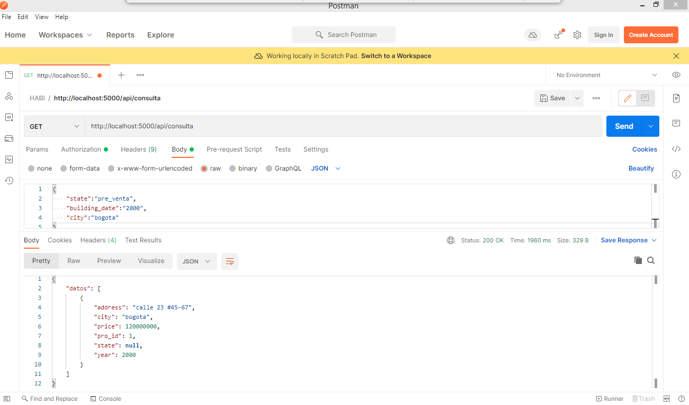
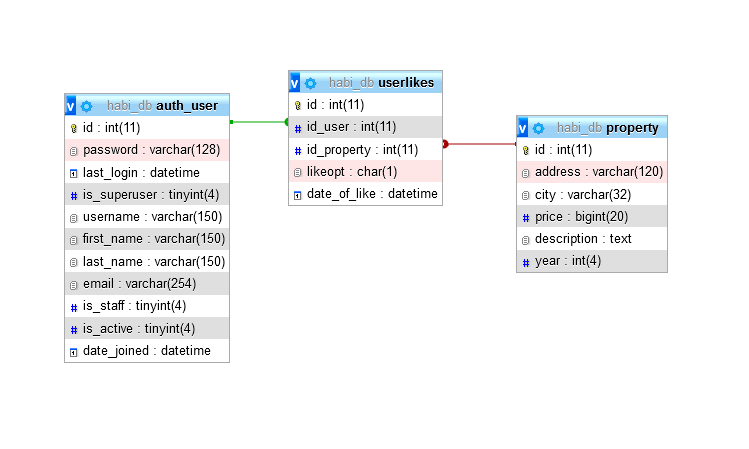

# Prueba HABI

La prueba en su primer punto ha sido desarrollada en python como se requirió.
Para el segundo punto se entrega en este mismo readme una descripción del modelo propuesto y un archivo de creacion de tabla "sqlinstaler.sql".

## Instalaciones

La versión PYTHON en la cual se ha desarrollado la aplicación es:
```bash
> python --version
Python 3.7.1
```

Use el manejador de paquetes [pip](https://pip.pypa.io/en/stable/) para instalar estos paquetes necesarios.

```bash
pip install mysql
pip install flask
```

## Uso
La aplicación está configurada para ejecutarse en el puerto 5000 del localhost.

El endpoint para consumir el servicio es

####/api/consulta
y el método 
```python
@app.route('/api/consulta')
def look_for_property():
```

Los datos esperados por el front con los filtros solicitados por el usuario se esperan como el siguiente JSON.
```json
{
    "state":"pre_venta",
    "building_date":"2000",
    "city":"bogota"
}
```
El único Key obligatorio es "state", "building_date" y "city" son opcionales.


La respuesta del servicio viene de la siguiente forma,
```json
{
    "datos": [
        {
            "address": "diagonal 23 #28-21",
            "city": "bogota",
            "price": 270000000,
            "pro_id": 3,
            "state": "comprado",
            "year": 2018
        },
        {
            "address": "carrera 100 #15-90",
            "city": "bogota",
            "price": 350000000,
            "pro_id": 2,
            "state": null,
            "year": 2011
        },
        {
            "address": "calle 23 #45-67",
            "city": "bogota",
            "price": 120000000,
            "pro_id": 1,
            "state": null,
            "year": 2000
        }
    ]
}
```

Una vez se levante el servicio se puede usar postman para realizar pruebas de la siguiente forma,


## SEGUNDO REQUERIMIENTO
Para el segundo requerimiento se ha propuesto crear una tabla adicional a la de usuarios autorizados y la de inmuebles. La relación es como muestra la figura,

El codigo MySQL que genera la tabla es la siguiente,
```sql
use habi_db;
-- creacion de tabla userlikes
create table if not exists userlikes(
id int primary key auto_increment,
id_user int not null,
id_property int not null,
likeopt char not null,
date_of_like datetime DEFAULT CURRENT_TIMESTAMP,
FOREIGN KEY (id_user) REFERENCES auth_user(id),
FOREIGN KEY (id_property) REFERENCES property(id),
UNIQUE KEY itemuser (`id_user`,`id_property`)
);
```
Se propone una relacion entre los id´s de  "auth_user" y "property", esto permite la referenciación entre los likes almacenados en "userlikes".

